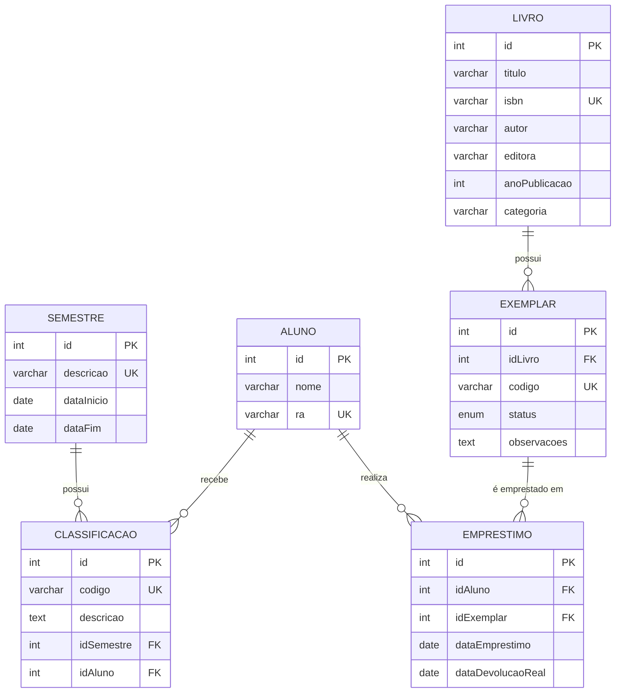
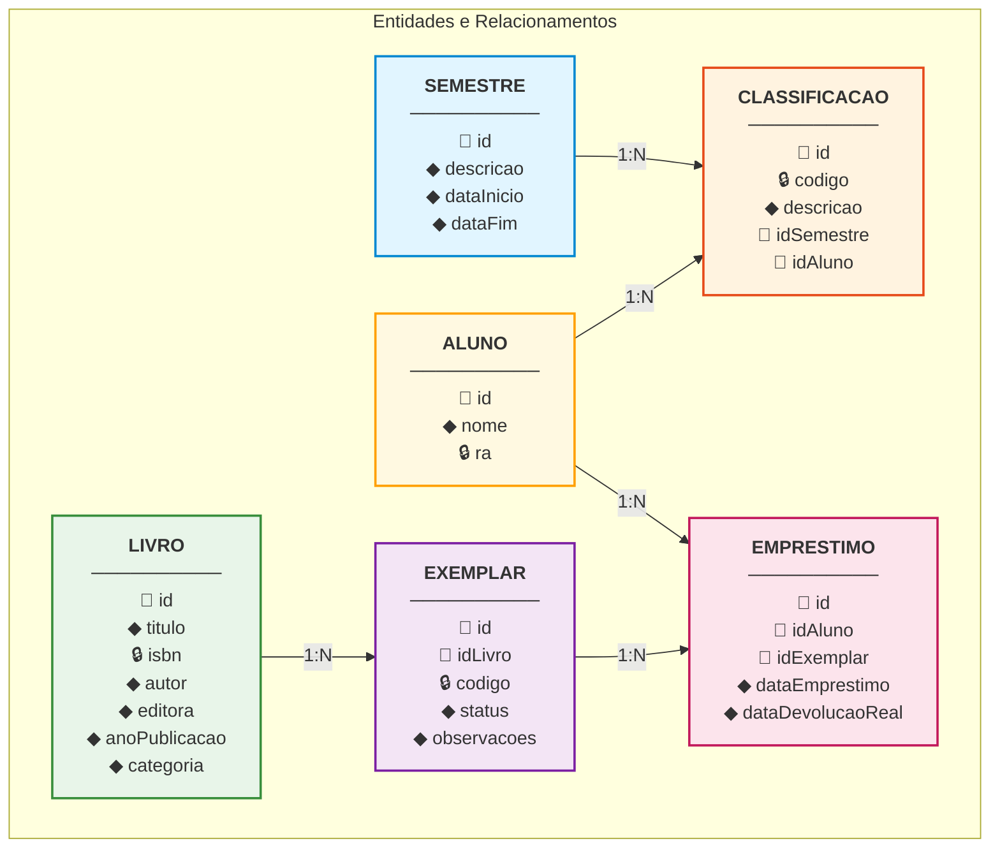

# 📊 Diagramas do Banco de Dados - Sistema de Biblioteca

## 🗂️ DER - Diagrama Entidade-Relacionamento

---

## 🔄 MER - Modelo Entidade-Relacionamento (Notação Pé de Galinha)

---

## 📋 Legenda

### Símbolos
- 🔑 **Chave Primária (PK)** - Identificador único
- 🔒 **Chave Única (UK)** - Valor único na tabela
- 🔗 **Chave Estrangeira (FK)** - Referência a outra tabela
- ◆ **Atributo** - Campo comum

### Cardinalidades
- **1:N** - Um para muitos
- **||--o{** - Um obrigatório para zero ou muitos

---

## 🔗 Relacionamentos Detalhados

### 1. SEMESTRE ↔ CLASSIFICACAO
- **Cardinalidade:** 1:N (Um semestre possui múltiplas classificações)
- **Descrição:** Cada semestre pode ter várias classificações de alunos, mas cada classificação pertence a apenas um semestre.

### 2. ALUNO ↔ CLASSIFICACAO
- **Cardinalidade:** 1:N (Um aluno recebe múltiplas classificações)
- **Descrição:** Cada aluno pode ter várias classificações ao longo dos semestres, mas cada classificação é de apenas um aluno.

### 3. ALUNO ↔ EMPRESTIMO
- **Cardinalidade:** 1:N (Um aluno realiza múltiplos empréstimos)
- **Descrição:** Cada aluno pode realizar vários empréstimos, mas cada empréstimo é realizado por apenas um aluno.

### 4. LIVRO ↔ EXEMPLAR
- **Cardinalidade:** 1:N (Um livro possui múltiplos exemplares)
- **Descrição:** Cada livro pode ter vários exemplares físicos, mas cada exemplar pertence a apenas um livro.

### 5. EXEMPLAR ↔ EMPRESTIMO
- **Cardinalidade:** 1:N (Um exemplar pode ter múltiplos empréstimos ao longo do tempo)
- **Descrição:** Cada exemplar pode ser emprestado várias vezes (histórico), mas cada empréstimo refere-se a apenas um exemplar.

---

## 📊 Descrição das Entidades

### SEMESTRE
**Propósito:** Definir períodos letivos para classificação de leitores.

| Campo | Tipo | Restrições | Descrição |
|-------|------|------------|-----------|
| id | INT | PK, AUTO_INCREMENT | Identificador único |
| descricao | VARCHAR(20) | NOT NULL, UNIQUE | Nome do semestre (ex: "2025-1") |
| dataInicio | DATE | - | Data de início do semestre |
| dataFim | DATE | - | Data de término do semestre |

### ALUNO
**Propósito:** Armazenar informações dos estudantes que utilizam a biblioteca.

| Campo | Tipo | Restrições | Descrição |
|-------|------|------------|-----------|
| id | INT | PK, AUTO_INCREMENT | Identificador único |
| nome | VARCHAR(100) | NOT NULL | Nome completo do aluno |
| ra | VARCHAR(20) | NOT NULL, UNIQUE | Registro Acadêmico |

### LIVRO
**Propósito:** Catalogar as obras disponíveis na biblioteca.

| Campo | Tipo | Restrições | Descrição |
|-------|------|------------|-----------|
| id | INT | PK, AUTO_INCREMENT | Identificador único |
| titulo | VARCHAR(200) | NOT NULL | Título da obra |
| isbn | VARCHAR(20) | UNIQUE | Código ISBN |
| autor | VARCHAR(100) | NOT NULL | Nome do autor |
| editora | VARCHAR(100) | NOT NULL | Nome da editora |
| anoPublicacao | INT | NOT NULL | Ano de publicação |
| categoria | VARCHAR(100) | - | Categoria/assunto do livro |

### EXEMPLAR
**Propósito:** Representar as cópias físicas de cada livro.

| Campo | Tipo | Restrições | Descrição |
|-------|------|------------|-----------|
| id | INT | PK, AUTO_INCREMENT | Identificador único |
| idLivro | INT | FK, NOT NULL | Referência ao livro |
| codigo | VARCHAR(50) | NOT NULL, UNIQUE | Código de identificação |
| status | ENUM | DEFAULT 'disponivel' | disponivel, emprestado, manutencao |
| observacoes | TEXT | - | Anotações sobre o exemplar |

### EMPRESTIMO
**Propósito:** Registrar o histórico de empréstimos e devoluções.

| Campo | Tipo | Restrições | Descrição |
|-------|------|------------|-----------|
| id | INT | PK, AUTO_INCREMENT | Identificador único |
| idAluno | INT | FK, NOT NULL | Referência ao aluno |
| idExemplar | INT | FK, NOT NULL | Referência ao exemplar |
| dataEmprestimo | DATE | NOT NULL | Data do empréstimo |
| dataDevolucaoReal | DATE | - | Data da devolução (NULL = pendente) |

### CLASSIFICACAO
**Propósito:** Classificar os alunos como leitores em cada semestre.

| Campo | Tipo | Restrições | Descrição |
|-------|------|------------|-----------|
| id | INT | PK, AUTO_INCREMENT | Identificador único |
| codigo | VARCHAR(20) | NOT NULL, UNIQUE | Código da classificação |
| descricao | TEXT | - | Descrição da classificação |
| idSemestre | INT | FK | Referência ao semestre |
| idAluno | INT | FK | Referência ao aluno |

---

## 🎯 Regras de Negócio

### Empréstimos
1. ✅ Um aluno pode ter múltiplos empréstimos simultaneamente
2. ✅ Um exemplar só pode estar emprestado para um aluno por vez
3. ✅ Um empréstimo sem `dataDevolucaoReal` está ativo
4. ✅ O status do exemplar deve ser atualizado:
   - `disponivel` → `emprestado` (ao emprestar)
   - `emprestado` → `disponivel` (ao devolver)

### Exemplares
1. ✅ Cada exemplar tem um código único
2. ✅ Status possíveis: `disponivel`, `emprestado`, `manutencao`
3. ✅ Apenas exemplares `disponivel` podem ser emprestados

### Classificação
1. ✅ A classificação é calculada por semestre
2. ✅ Baseia-se no número de livros lidos (devolvidos) no período
3. ✅ Cada classificação tem um código único

---

## 🔧 Constraints e Integridade

### Foreign Keys com CASCADE
- `exemplar.idLivro` → `livro.id` (ON DELETE CASCADE)
  - Deletar um livro remove todos seus exemplares

### Foreign Keys sem CASCADE
- `emprestimo.idAluno` → `aluno.id`
- `emprestimo.idExemplar` → `exemplar.id`
- `classificacao.idSemestre` → `semestre.id`
- `classificacao.idAluno` → `aluno.id`

### Unique Constraints
- `semestre.descricao` - Evita semestres duplicados
- `aluno.ra` - RA único por aluno
- `livro.isbn` - ISBN único por livro
- `exemplar.codigo` - Código único por exemplar
- `classificacao.codigo` - Código único de classificação

